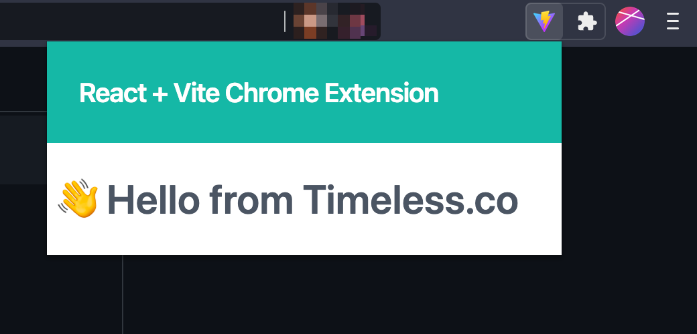

# React + Vite Chrome Extension Starter


This project is a boilerplate for creating a Google Chrome Extension with React + Vitejs + TailwindCSS.

- [React](https://reactjs.org/)
- [Vite](https://vitejs.dev/)
- [Tailwind CSS](https://tailwindcss.com/)

## :bulb: Preview



## :package: Requirements

- Nodejs v16 LTS

## :atom_symbol: Development

- Clone this repository

```
git clone https://github.com/timelessco/react-vite-chrome-extension
```

- Install dependencies

```
yarn install
```

- Start Development Server

```
yarn dev
```

## :computer: Production

- Building the chrome extension for production

```
yarn build
```

## :rocket: Usage

- You can find the chrome extension contents in the `dist` folder
- Open `chrome://extension` and turn on Developer Mode.
- Click the `Load unpacked extension` button.
- Now, select the `dist` folder.
- Your extension is ready to use.

### :hamburger: Additional Details

- This boilerplate can be extended even further using [Chrome Extension APIs](https://developer.chrome.com/docs/extensions/reference/)
- You can use [Content Scripts](https://developer.chrome.com/docs/extensions/mv3/content_scripts/) to inject content into the page or accessing the DOM conent.
- By using the [Message Passing](https://developer.chrome.com/extensions/messaging) API, you can communicate with the content script and the popup.

## :green_heart: Message

I hope you find this useful. If you have any questions, please create an issue.

## :mortar_board: License

- MIT
